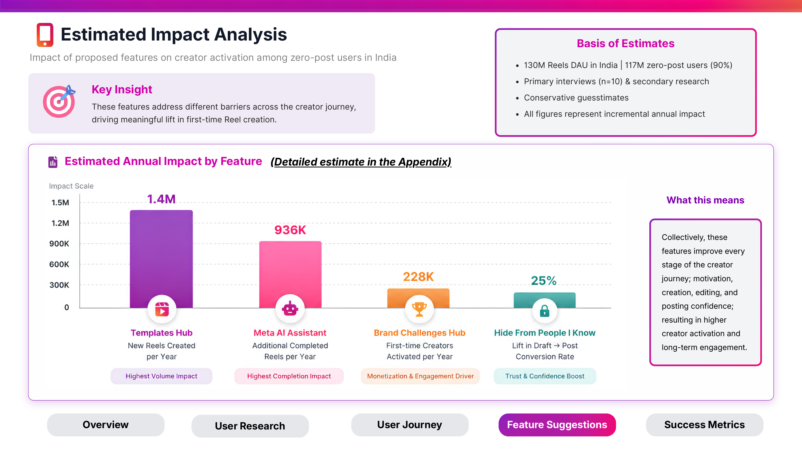

# Instagram Reels Product Teardown: Turning Viewers Into Creators

A UX research and product strategy case study on Instagram Reels in India, identifying why 90% of daily users never post a single Reel, and proposing four features to close that gap.

## The problem

Instagram Reels has 130M daily active users in India, spending an average of 32 minutes a day, with Reels accounting for 70% of total time spent on the app. Despite that scale, the platform follows the classic 90-9-1 pattern: 90% of users only watch, 9% engage occasionally, and just 1% post regularly.

414M Indian users open Reels multiple times a day. Almost none of them ever create one. This case study investigates why, and designs features to fix it.

## Research methodology

- Analyzed Play Store reviews, Reddit threads, and an existing Kantar/IFSO privacy study to surface recurring complaints
- Conducted 10 one-on-one user interviews and ran a 52-response survey
- Built three data-backed personas representing distinct non-creator segments: a teenager who feels his content isn't "post-worthy," a college student who abandoned editing due to tool friction, and an adult with zero intent to ever create
- Mapped the complete 8-step user journey from opening the app to publishing, isolating the exact step where users disengage
- Ran a competitive teardown against Snapchat and YouTube Shorts to benchmark creator-onboarding mechanics

## Key findings

**Social visibility is the top blocker, not general privacy.** Users aren't worried about strangers seeing their content, they're worried about classmates, cousins, and coworkers seeing an imperfect first attempt. One in three users maintain a separate "finsta" account specifically to avoid this.

**The editor itself causes drop-off.** App crashes, audio desync, and an unstructured camera screen with no clear starting point were the most cited reasons users abandoned a Reel mid-creation, according to Play Store review analysis and user interviews.

**There is no incentive structure for first-time creators.** Consumption already satisfies most users' needs on the platform. Unlike Snapchat and YouTube Shorts, Instagram has no dedicated onboarding nudge or reward mechanism to convert a viewer into a creator.

## Proposed solutions

| Feature | Problem it solves |
|---|---|
| **Hide From People I Know** | Lets users post publicly and keep algorithmic reach, while hiding the Reel from their own phone contacts |
| **Templates Hub** | Pre-built cuts, transitions, and text overlays that remove the blank-screen starting problem |
| **Meta AI Assistant** | Auto-generates captions, hashtags, and edit suggestions at the exact point users typically abandon a draft |
| **Brand Challenges Hub** | Branded contests with real prizes and profile badges, giving users a concrete reason to post |

## Projected impact

Each feature was sized using conservative, bottom-up estimates built from India's Reels DAU base and interview-derived conversion assumptions. Full calculations and assumptions are in the appendix of the deck.

## Success metrics

**North star metric:** percentage of zero-post users who publish their first Reel within 30 days of exposure to a feature.

Supporting metrics: template usage rate, draft-to-post conversion rate, brand challenge entry rate, and user drop-off rate by journey step.

## Full case study

[Instagram_Reel_Breakdown.pdf](./Instagram_Reel_Breakdown.pdf) — complete deck including all personas, the full 8-step journey map, competitive matrix, and impact appendix.

---

Independent, self-directed case study. Not affiliated with Meta or Instagram.

**Aashita Garg** | aashitagarg06@gmail.com
